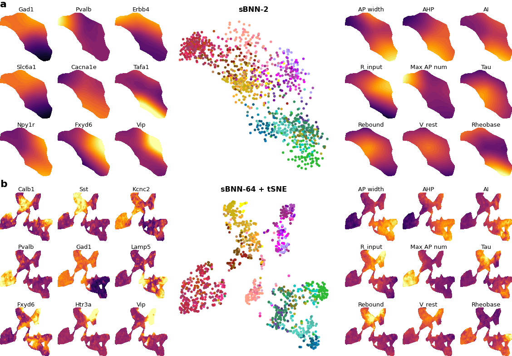

# Sparse bottleneck neural networks for exploratory non-linear visualization of Patch-seq data
A sparse bottleneck neural network to predict electrophysiological properties of neurons from their gene expression.
Code corresponds to work found on [ArXiv](https://arxiv.org/abs/2006.10411).

  
## Requirements:

TensorFlow and Keras, specifically. We used version 2.7.0 for TensorFlow 2 and 2.7.0 for Keras (https://keras.io/#installation).
Glmnet, a package to fit generalized linear models with penalties like ridge and lasso (https://github.com/bbalasub1/glmnet_python).

For the sparse bottleneck neural network framework and linear models, cross validation takes on average ~10 minutes. If performed once, the data can be pickled, however, so that one does not need to rerun the models everytime for plotting. Check `KerasSavedModels/scala_2020_tf2`, `KerasSavedModels/gouwens_2020_tf2`, `KerasSavedModels/stoeckius_2017_tf2`, `KerasSavedModels/scala_2020_with_ion_channel_genes_tf2` for pickled results. These can indeed directly be used in the notebooks for plotting and reproducing figures.

## Data
All the data can be found in the folders `data/scala_2020`, `data/gouwens_2020` and `data/stoeckius_2017` which are needed to run the notebooks all the way. The first dataset we call the M1 dataset in our paper and corresponds to the following [Nature](https://www.nature.com/articles/s41586-020-2907-3) study from previous work conducted in this lab and collaborative labs. The 2nd we call the V1 dataset which corresponds to work from the Allen Institute reported in [Cell](https://www.cell.com/cell/pdf/S0092-8674(20)31254-X.pdf) and the 3rd is called the CITE-seq dataset reported in [Nature Methods](https://www.nature.com/articles/nmeth.4380).

## Preprocessing
Preprocessing can be found in `preprocess.ipynb`. To run it for the M1 dataset, make sure you un-archive `data/scala_2020/final_patch_seq_allcells_exon_allreads.rar` and put `final_patch_seq_allcells_exon_allreads.txt` in that same folder. For the CITE-seq dataset, you need to get `GSE100866_CBMC_8K_13AB_10X-RNA_umi.csv` from the [NCBI portal](https://www.ncbi.nlm.nih.gov/geo/query/acc.cgi?acc=GSE100866) and put it in `data/stoeckius_2017`. Preprocessing produces `.pickle` files in the same respective directories and are added to this GitHub repo (note that for CITE-seq, you'll need to unzip that first and put it in the same directory). One therefore does not _have_ to run the preprocessing and can move on directly to cross validation and full dataset visualizations.

## Cross validation
Cross validation has been performed for both the linear framework (sparse reduced-rank regression, sRRR) and nonlinear framework (sparse bottleneck neural network, sBNN) applied to the M1, V1 and CITE-seq dataset in `M1_cv_2d_bottleneck.ipynb`, `M1_cv_64d_bottleneck.ipynb`, `M1_cv_with_ion_channel_genes_2d_bottleneck.ipynb`, `V1_cv_2d_bottleneck.ipynb`,
`V1_cv_64d_bottleneck.ipynb`, `CITE-seq_cv_2d_bottleneck.ipynb` and `CITE-seq_cv_64d_bottleneck.ipynb` respectively. Results are pickled in `KerasSavedModels` so it is possible to produce figures also without running the cross validation.

## Figures
With optimal parameters deduced from the cross validation, one can run models for the full datasets in `M1_full_dataset_2d_bottleneck.ipynb`, `M1_full_dataset_64d_bottleneck.ipynb`, `M1_full_dataset_with_ion_channel_genes_2d_bottleneck.ipynb`, `M1_full_dataset_with_ion_channel_genes_64d_bottleneck.ipynb`, `V1_full_dataset_2d_bottleneck.ipynb`, `V1_full_dataset_64d_bottleneck.ipynb`, `CITE-seq_full_dataset_2d_bottleneck.ipynb` and `CITE-seq_full_dataset_64d_bottleneck.ipynb`. Trained neural network weights will be saved in `KerasSavedModels` and can then be used to produce final figures in `combined_figures.ipynb`.

Work conducted under supervision of Dmitry Kobak and Philipp Berens.
  

## Contact
Lead contact: philipp.berens@uni-tuebingen.de  
First author contact: yves.bernaerts@research.fchampalimaud.org
