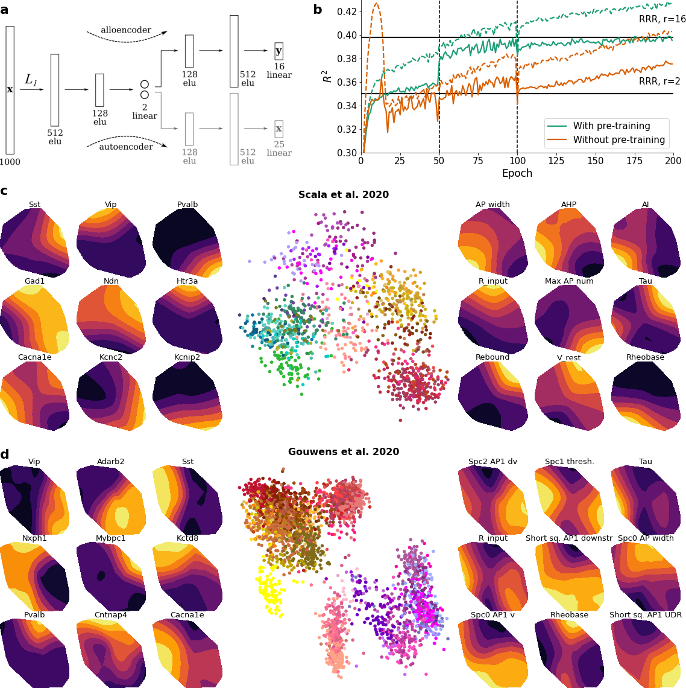

# Sparse Bottleneck Networks for Exploratory Analysis and Visualization of Neural Patch-seq Data
A sparse bottleneck neural network to predict electrophysiological properties of neurons from their gene expression.
Code to produce results and figures in "Sparse Bottleneck Networks for Exploratory Analysisand Visualization of Neural Patch-seq Data" paper: https://arxiv.org/abs/2006.10411, but also more has been added.
  
**Requirements:**

TensorFlow and Keras, specifically. We used version 1.13.1 for TensorFlow and 2.2.4 for Keras (https://keras.io/#installation).
Glmnet, a package to fit generalized linear models with penalties like ridge and lasso (https://github.com/bbalasub1/glmnet_python). These notebooks have not been tested with TensorFlow 2.

For the bottleneck neural network framework and linear models, cross validation takes on average ~10 minutes. If performed once, the data can be pickled, however, so that one does not need to rerun the models everytime for plotting. Check KerasSavedModels for pickled results. These can indeed directly be used in the notebooks for plotting and to reproduce the figures of the paper.

**Data**
All the data can be found in the folders `data/scala_2020` and `data/gouwens_2020` which are needed to run the notebooks all they way. The former corresponds to the following [Nature](https://www.nature.com/articles/s41586-020-2907-3) study from previous work conducted in this lab. The latter corresponds to work from the Allen Institute reported in [Cell]https://www.cell.com/cell/pdf/S0092-8674(20)31254-X.pdf

**Preprocessing**
Preprocessing can be found in `preprocess.ipynb`. To run it, make sure you un-archive `data/scala_2020/final_patch_seq_allcells_exon_allreads.rar` and put `final_patch_seq_allcells_exon_allreads.txt` in that same folder!

Work conducted under supervision of Dmitry Kobak and Philipp Berens.

Contact: yves.bernaerts@uni-tuebingen.de

Website: http://www.eye-tuebingen.de/berenslab/members/yves-bernaerts/
